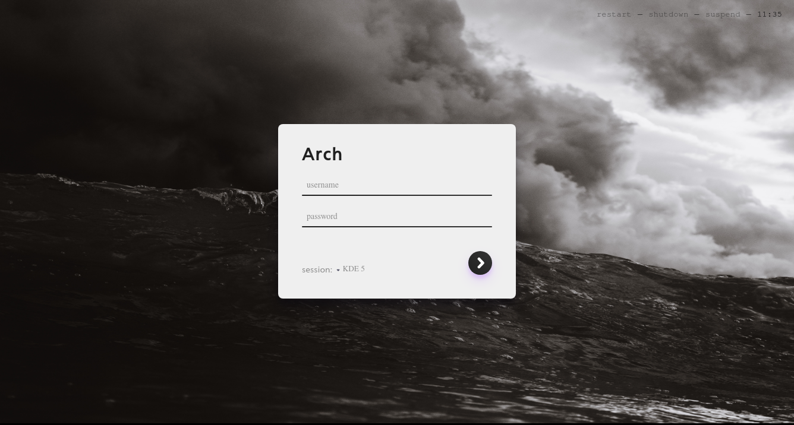

# enkel-greeter

A theme for lightdm-webkit2-greeter



## Installation

 1. Download the latest release from the Releases tab.
 2. Extract the folder and copy to `/usr/share/lightdm-webkit/themes`
 3. In `/etc/lightdm/lightdm-webkit2-greeter.conf`, change the value of `webkit_theme` to `enkel`.

## Change background image

Change the background image by replacing the file `background.jpg` in the folder `enkel/assets/` with your preferred image.

## Development

Recommended to use `yarn` over `npm`

- `yarn` to install dependencies
- `yarn dev` runs webpack-dev-server
- `yarn build` creates bundle and assets over `/dist`

## License

This software is distributed under MIT license:

```
MIT License

Permission is hereby granted, free of charge, to any person obtaining a copy
of this software and associated documentation files (the "Software"), to deal
in the Software without restriction, including without limitation the rights
to use, copy, modify, merge, publish, distribute, sublicense, and/or sell
copies of the Software, and to permit persons to whom the Software is
furnished to do so, subject to the following conditions:

The above copyright notice and this permission notice shall be included in all
copies or substantial portions of the Software.

THE SOFTWARE IS PROVIDED "AS IS", WITHOUT WARRANTY OF ANY KIND, EXPRESS OR
IMPLIED, INCLUDING BUT NOT LIMITED TO THE WARRANTIES OF MERCHANTABILITY,
FITNESS FOR A PARTICULAR PURPOSE AND NONINFRINGEMENT. IN NO EVENT SHALL THE
AUTHORS OR COPYRIGHT HOLDERS BE LIABLE FOR ANY CLAIM, DAMAGES OR OTHER
LIABILITY, WHETHER IN AN ACTION OF CONTRACT, TORT OR OTHERWISE, ARISING FROM,
OUT OF OR IN CONNECTION WITH THE SOFTWARE OR THE USE OR OTHER DEALINGS IN THE
SOFTWARE.
```

## Credits
- Background photo by [Matt Hardy on Unsplash](https://unsplash.com/photos/55NI4yEAas4)
